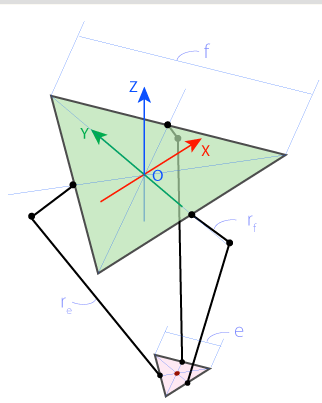

# Nema17 Delta Robot (WIP!)

Parametric Delta Robot with NEMA17 stepper motors. By selecting the length of the profiles (e,f,rf,re) the desired workspace and characteristics can be achieved.

*Geometric parameters, sketch taken from https://hypertriangle.com/~alex/delta-robot-tutorial/*

# Software

For forward and inverse kinematics please check this awesome source: https://hypertriangle.com/~alex/delta-robot-tutorial/

# Construction

See https://www.thingiverse.com/thing:6248772

Pulley is a remix from here: https://www.thingiverse.com/thing:16627

## To buy

    6x Senkkopfschrauben Edelstahl A2 V2A DIN 7991 Innensechskant M8 8 x 40 mm
    12x Gelenkkopf Außen M8  Uniballgelenk Kugelkopf Links und Rechts
    3x 6mm GT2 Zahnrad Pulley Ritzel Scheibe 40Zahn Ø8mm
    3x Nema17 Planetengetriebe Gear Reducer Ratio 5:1 φ5mm Input Shaft
    3x GT2 6mm geschloßener Zahnriemen 256
    6x Kugellager 61906 2RS Kugellager 6906 2RS 30x47x9mm
    3x M8 Gewindestange 10cm
    6x M8 Mutter
    3x Aluprofile (L5,) 20x20mm

    6x Aluprofile (L1 == f) 20x20mm
    3x Aluprofile (L2 == rf) 20x20mm
    3x Aluporfile (L3 == e) 10x10mm
    6x GFK/Aluminium Rundrohr 10cm  (L4==re) Durchmesser

    const float e = 115.0;     // end effector
    const float f = 457.3;     // base
    const float re = 232.0;
    const float rf = 112.0;
    
    1x CNC Shield V3 Development Board for A4988 drivers Stepper for 3D printer compatible with Arduino
    1x Arduino Mega
    3x Micro Limit Switch
    3x Nema17 Stepper Motor

